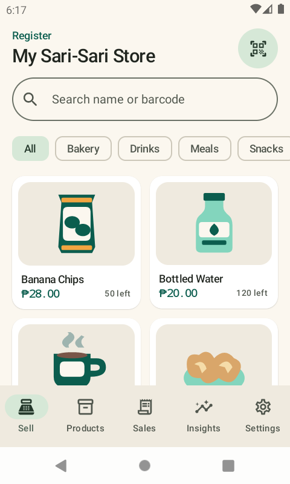
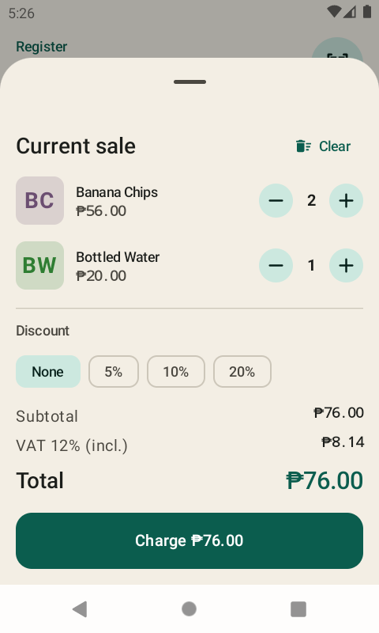
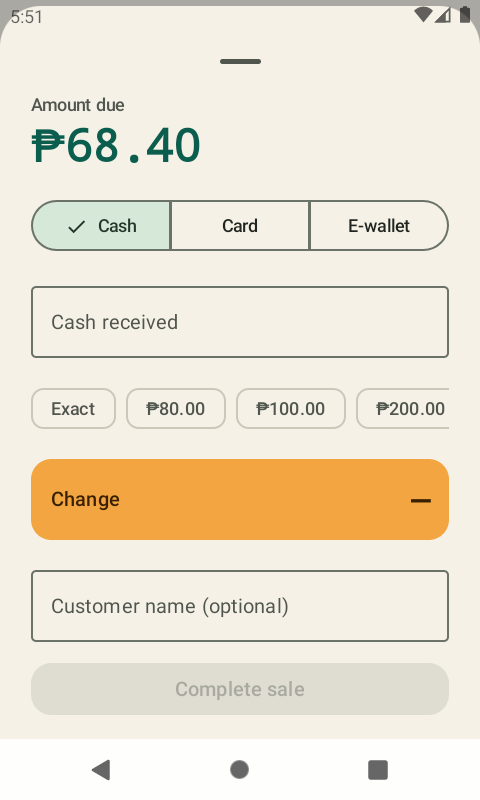
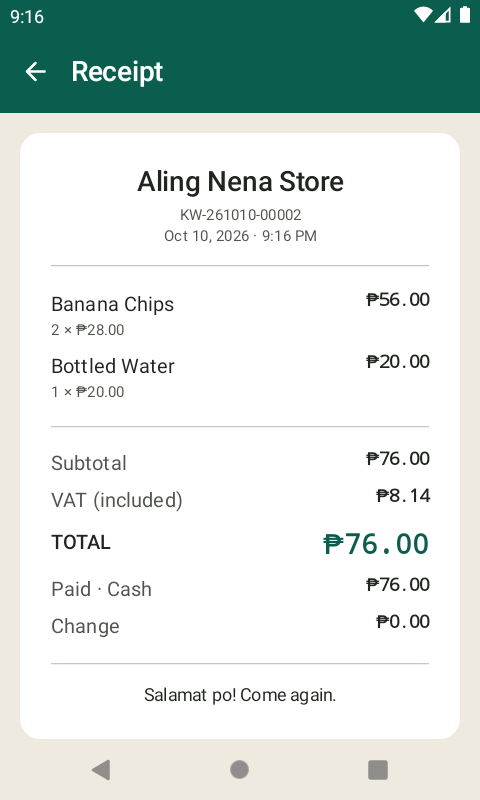
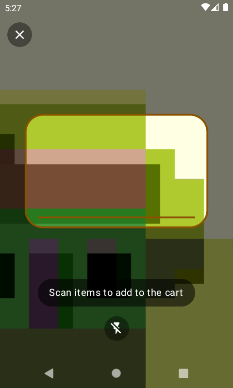
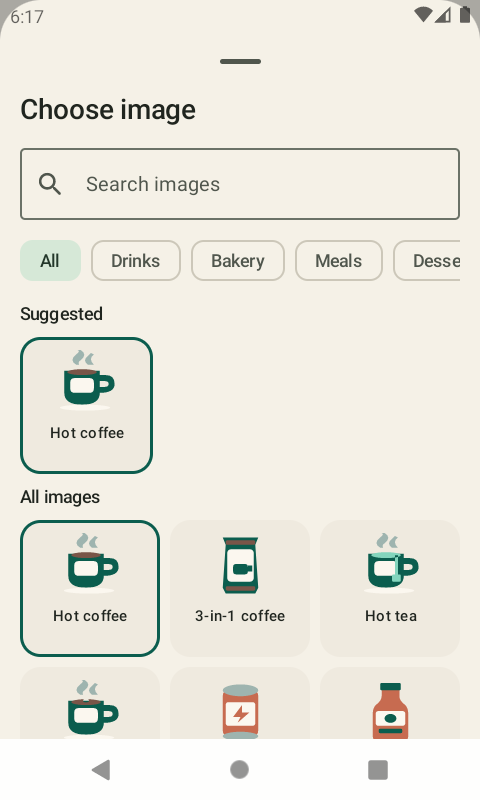
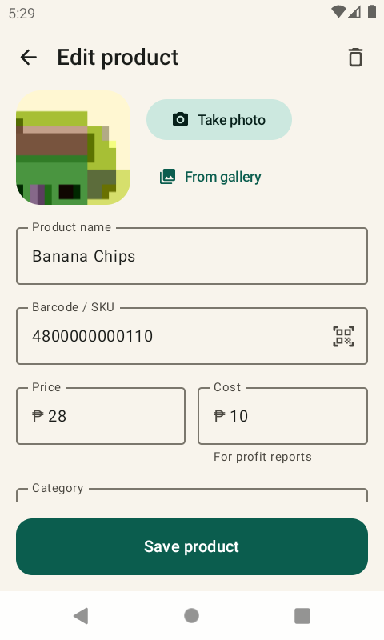
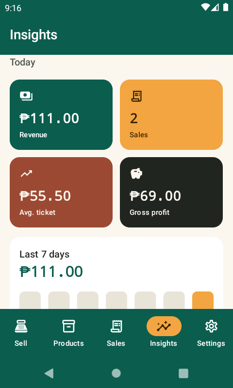
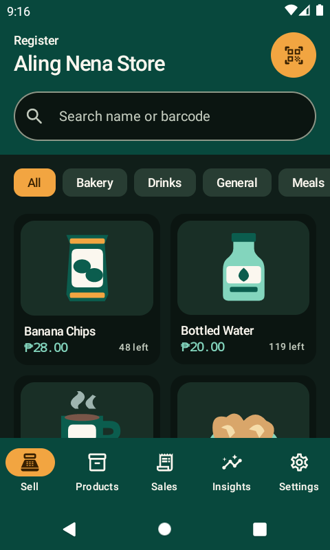

<p align="center"></p>

# Kwentaro

**Kwentaro** is an offline-first point-of-sale app for Android, written in Kotlin with Jetpack Compose and Material 3. It's built for sari-sari stores, cafés, bakeries and market stalls. The name comes from the Filipino *kwenta*, to count or tally.

Kwentaro has no accounts, no server, and no subscription. All data stays on the device.

<p>
  
  
  
  
</p>
<p>
  
  
  
  
  
</p>

## Features

- **Register.** A product grid with search and category filters. Tap a product to add it, and adjust quantities in the cart. You can also apply a 5/10/20% discount. Quantities can't exceed stock on hand.
- **Camera barcode scanning.** Uses CameraX and on-device ML Kit, and reads EAN, UPC, QR, Code 128 and more. In continuous mode, every scan adds the item to the cart. There is a flashlight toggle, and the scanner falls back to the front camera on devices that have no rear camera.
- **Product images.** Take a photo in the app with CameraX, pick one from the gallery, or choose from **126 built-in illustrations** of everyday PH store items (kape, pandesal, itlog, sardinas, e-load, and more). The illustrations are searchable in English and Tagalog. They are tiny vector drawables, about 63 KB in the APK for the whole set. New products get a matching image picked automatically from their name. Products with no image get a colored monogram tile.
- **Checkout.** Pay by cash, card or e-wallet. For cash, quick-tender chips (Exact, next ₱20/50/100/500…) fill in the amount and the change is calculated live. You can add an optional customer name.
- **VAT/tax.** Tax can be included in the price (the default, 12% PH VAT) or added on top. Money is stored in centavos, so totals never drift.
- **Receipts.** Each sale gets a receipt number (`KW-YYMMDD-#####`). Receipts can be shared as text through any app (Messenger, Viber, email…). You can refund a sale, which puts its items back into stock.
- **Inventory.** Track stock and cost for each item, set low-stock alerts, and edit a product by scanning its barcode.
- **Insights.** Today's revenue, sale count, average ticket and gross profit, plus a 7-day bar chart, the week's best sellers and a restock list.
- **Material 3.** Custom "Palengke" jade-and-mango palette with light and dark themes and optional Material You dynamic color. Phones get a bottom bar, and tablets get a navigation rail with the cart in a side panel.

Brand assets, the color palette and type notes are in [`docs/brand`](docs/brand/README.md).

## Tech

| Layer | Library |
|---|---|
| UI | Jetpack Compose, Material 3, Navigation Compose |
| Camera | CameraX (`camera-view`, `camera-mlkit-vision`) |
| Barcodes | ML Kit Barcode Scanning (bundled model, works offline) |
| Storage | Room (products, sales, sale items), DataStore (settings) |
| Images | Coil |

The minimum SDK is 26 (Android 8.0) and the target SDK is 36.

## Tests

```bash
./gradlew testDebugUnitTest          # VAT, discount, money parsing, EAN-13 check digits
./gradlew connectedDebugAndroidTest   # decodes a real EAN-13 with the bundled ML Kit scanner
```

## Build

The build needs JDK 17 and the Android SDK.

```bash
./gradlew assembleDebug
adb install app/build/outputs/apk/debug/app-debug.apk
```

Or open the project in Android Studio and press Run. On first launch, the app is seeded with a sample catalogue.

## Project layout

```
app/src/main/java/com/phcodesage/kwentaro/
├── data/          Room entities & DAOs, PosRepository (checkout/refund transactions), settings
├── ui/register/   Selling screen, cart, checkout sheet
├── ui/products/   Catalogue list & editor (photo + barcode)
├── ui/sales/      Sales history & receipt
├── ui/dashboard/  Insights
├── ui/settings/   Store, tax, appearance
├── ui/camera/     CameraX scanner & photo capture
└── ui/theme/      Colors, type, shapes
```

## Versioning & releases

The app version is set in one place: `appVersion` in [`gradle.properties`](gradle.properties). Everything else is derived from it.

- `versionName` is `1.0.0` (debug builds show `1.0.0-debug`). `versionCode` is `MAJOR*10000 + MINOR*100 + PATCH`, so `1.0.0` becomes `10000`.
- APKs are named `kwentaro-v1.0.0-debug.apk` / `kwentaro-v1.0.0-release.apk`.
- **Settings → About** shows the version and the git commit it was built from.
- Run `./gradlew printVersion` to see the current version.

To cut a release, bump `appVersion`, add a section to [`CHANGELOG.md`](CHANGELOG.md), commit, then push a tag `vX.Y.Z`. The Release workflow checks that the tag matches `appVersion`, builds the APKs and publishes a GitHub Release with the changelog notes. A signed release APK is also attached when the `KWENTARO_KEYSTORE_BASE64`, `KWENTARO_KEYSTORE_PASSWORD`, `KWENTARO_KEY_ALIAS` and `KWENTARO_KEY_PASSWORD` secrets are set. Locally, signing reads `keystore.properties`.

## License

MIT
