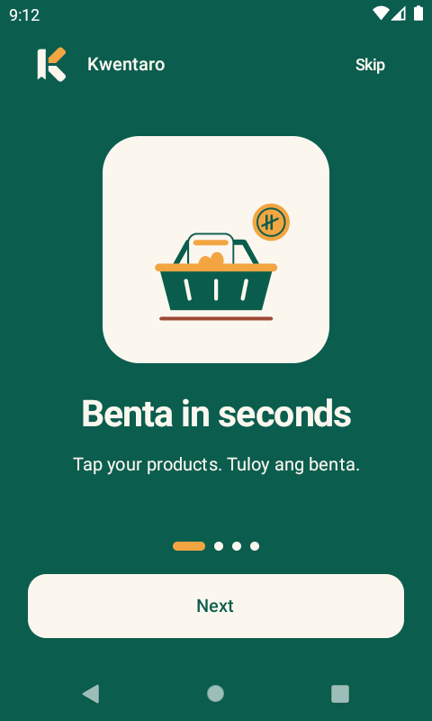
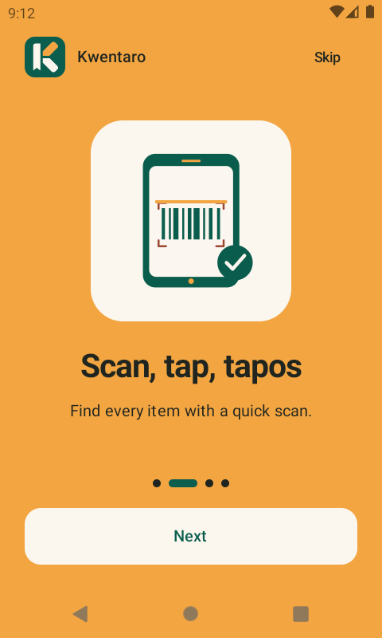
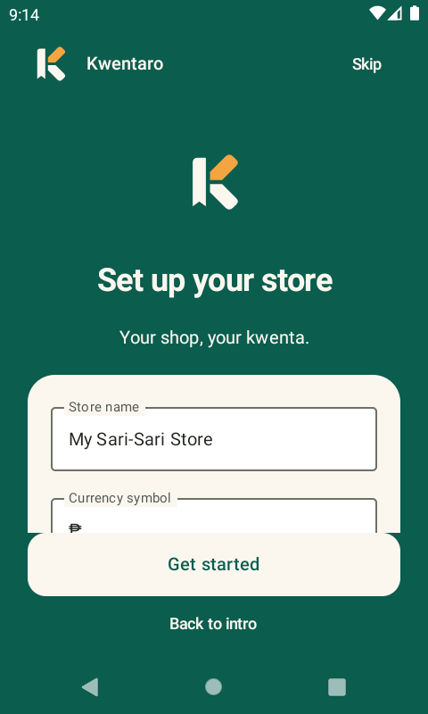
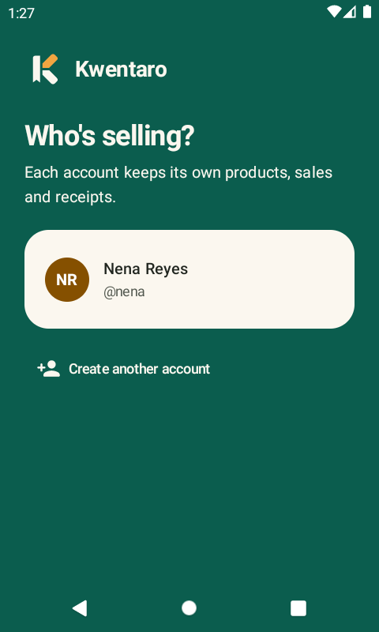

<p align="center"></p>

# Kwentaro

**Kwentaro** is an offline-first point-of-sale app for Android, written in Kotlin with Jetpack Compose and Material 3. It's built for sari-sari stores, cafés, bakeries and market stalls. The name comes from the Filipino *kwenta*, to count or tally.

Kwentaro is **free and open source (MIT)**. There's no server, no subscription and no cloud: all data stays on the device. Several people can share one phone with **offline accounts**, and each account keeps completely separate records.

<p>
  
  
  
  
</p>
<p>
  
  
  
  
</p>
<p>
  
  
  
  
  
</p>

## Features

- **Offline accounts.** Sign up with a name, username and password, with no internet or email needed. Passwords are stored only as salted PBKDF2 hashes. Each account has its **own database and settings files**, so products, sales and receipts never mix between people. Signing up shows a one-time **recovery code** for resetting a forgotten password offline. Settings lets you change your password, sign out or switch accounts, and delete an account. When upgrading from an older version, the first account adopts the existing store data.
- **Onboarding.** On first launch, four short Lottie animations introduce the app, followed by a quick store setup (name and currency). You can replay it from Settings. If the system has animations turned off, it shows still frames instead.

- **Register.** A product grid with search and category filters. Tap a product to add it, and adjust quantities in the cart. You can also apply a 5/10/20% discount. Quantities can't exceed stock on hand.
- **Camera barcode scanning.** Uses CameraX with on-device ML Kit (`full` build) or ZXing (`foss` build), and reads EAN, UPC, QR, Code 128 and more. In continuous mode, every scan adds the item to the cart. There is a flashlight toggle, and the scanner falls back to the front camera on devices that have no rear camera.
- **Product images.** Take a photo in the app with CameraX, pick one from the gallery, or choose from **126 built-in illustrations** of everyday PH store items (kape, pandesal, itlog, sardinas, e-load, and more). The illustrations are searchable in English and Tagalog. They are tiny vector drawables, about 63 KB in the APK for the whole set. New products get a matching image picked automatically from their name. Products with no image get a colored monogram tile.
- **Checkout.** Pay by cash, card or e-wallet. For cash, quick-tender chips (Exact, next ₱20/50/100/500…) fill in the amount and the change is calculated live. You can add an optional customer name.
- **VAT/tax.** Tax can be included in the price (the default, 12% PH VAT) or added on top. Money is stored in centavos, so totals never drift.
- **Receipts.** Each sale gets a receipt number (`KW-YYMMDD-#####`). Receipts can be shared as text through any app (Messenger, Viber, email…). You can refund a sale, which puts its items back into stock.
- **Inventory.** Track stock and cost for each item, set low-stock alerts, and edit a product by scanning its barcode.
- **Insights.** Today's revenue, sale count, average ticket and gross profit, plus a 7-day bar chart, the week's best sellers and a restock list.
- **Material 3, solid style.** Bold, flat "Palengke" colors: solid jade bars and navigation with mango accents. Custom jade-and-mango palette with light and dark themes and optional Material You dynamic color. Phones get a bottom bar, and tablets get a navigation rail with the cart in a side panel.

Brand assets, the color palette and type notes are in [`docs/brand`](docs/brand/README.md).

## Tech

| Layer | Library |
|---|---|
| UI | Jetpack Compose, Material 3, Navigation Compose |
| Camera | CameraX (`camera-view`, `camera-mlkit-vision`) |
| Barcodes | `full`: ML Kit Barcode Scanning (bundled model) · `foss`: ZXing |
| Storage | Room (one database per account, plus an accounts DB), DataStore (per-account settings) |
| Auth | Offline PBKDF2-HMAC-SHA256 password hashes, recovery codes |
| Animation | Lottie (onboarding) |
| Images | Coil |

The minimum SDK is 26 (Android 8.0) and the target SDK is 36.

## Tests

```bash
./gradlew testFullDebugUnitTest testFossDebugUnitTest   # VAT, money, accounts/hashing, templates, ZXing decoding at every rotation
./gradlew connectedFullDebugAndroidTest                 # decodes a real EAN-13 with the bundled ML Kit scanner (wipes app data on the device)
```

## Build

The build needs JDK 17 and the Android SDK.

```bash
./gradlew assembleFossDebug    # 100% open source
./gradlew assembleFullDebug    # with Google ML Kit
adb install app/build/outputs/apk/foss/debug/kwentaro-v*-foss-debug.apk
```

Or open the project in Android Studio, pick a build variant, and press Run. New accounts can start with a sample catalogue.

### Build variants

| Variant | Barcode engine | Proprietary code | Permissions | For |
|---|---|---|---|---|
| **`foss`** | ZXing (Apache-2.0) | **None** | Camera only, **no internet** | F-Droid, IzzyOnDroid, GitHub |
| `full` | Google ML Kit (bundled) | ML Kit, Play Services basement | Camera, plus internet/network state added by ML Kit's telemetry | Google Play and other stores |

Both variants share all code except the scanner engine (`app/src/{foss,full}`). F-Droid store metadata lives in [`fastlane/metadata/android`](fastlane/metadata/android).

## Privacy

Kwentaro has no analytics, ads or trackers of its own, and no backend. Shop data and account credentials never leave the device unless you share a receipt or export something yourself. The `foss` build can't reach the internet at all, since it doesn't request the permission. The `full` build includes Google ML Kit, whose bundled library sends anonymous usage telemetry to Google. Choose `foss` if that matters to you.

## Contributing

Issues and pull requests are welcome, especially translations, product illustrations and features for small shops. See [CONTRIBUTING.md](CONTRIBUTING.md), [CODE_OF_CONDUCT.md](CODE_OF_CONDUCT.md) and [SECURITY.md](SECURITY.md).

## Project layout

```
app/src/main/java/com/phcodesage/kwentaro/
├── data/          Room entities & DAOs, PosRepository (checkout/refund transactions), settings
├── data/auth/     Offline accounts, password hashing, per-account sessions
├── ui/register/   Selling screen, cart, checkout sheet
├── ui/products/   Catalogue list & editor (photo + barcode)
├── ui/sales/      Sales history & receipt
├── ui/dashboard/  Insights
├── ui/settings/   Store, tax, appearance
├── ui/auth/       Sign in / sign up / recovery
├── ui/camera/     CameraX scanner & photo capture (engine per flavor in src/full, src/foss)
└── ui/theme/      Colors, type, shapes
```

## Versioning & releases

The app version is set in one place: `appVersion` in [`gradle.properties`](gradle.properties). Everything else is derived from it.

- `versionName` is `1.0.0` (debug builds show `1.0.0-debug`). `versionCode` is `MAJOR*10000 + MINOR*100 + PATCH`, so `1.0.0` becomes `10000`.
- APKs are named `kwentaro-v1.0.0-debug.apk` / `kwentaro-v1.0.0-release.apk`.
- **Settings → About** shows the version and the git commit it was built from.
- Run `./gradlew printVersion` to see the current version.

To cut a release, bump `appVersion`, add a section to [`CHANGELOG.md`](CHANGELOG.md), commit, then push a tag `vX.Y.Z`. The Release workflow checks that the tag matches `appVersion`, builds the APKs and publishes a GitHub Release with the changelog notes. A signed release APK is also attached when the `KWENTARO_KEYSTORE_BASE64`, `KWENTARO_KEYSTORE_PASSWORD`, `KWENTARO_KEY_ALIAS` and `KWENTARO_KEY_PASSWORD` secrets are set. Locally, signing reads `keystore.properties`.

## License

MIT
