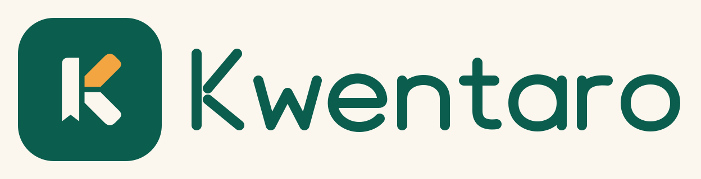

# Kwentaro brand and Palengke theme

## The tally K

Kwentaro comes from **kwenta**, to count or tally. The mark turns that idea into three bold strokes: a paper upright with a receipt tear at its foot, a mango counting stroke, and a paper lower stroke. Together they read as K. The detached strokes and horizontal gap give the silhouette its identity at small sizes; the color adds warmth without carrying the meaning alone.

Deep jade anchors the mark, warm paper recalls a receipt, and ripe mango marks a completed count. The rounded outer terminals feel approachable at a neighborhood shop; the straight inner edges keep the mark crisp. The wordmark is original rounded geometric lettering drawn as SVG paths. It needs no installed font or external asset.

### Assets and usage

- [logo.svg](logo.svg): 1024 × 1024 full-color mark on an unrounded jade background. Let the destination apply its own icon mask.
- [logo-wordmark.svg](logo-wordmark.svg): 1248 × 320 horizontal lockup on warm paper; all lettering is vector geometry.
- `app/src/main/res/drawable/ic_launcher_foreground.xml`: full-color adaptive foreground on a 108dp canvas.
- `app/src/main/res/drawable/ic_launcher_monochrome.xml`: the same geometry in one opaque color. Android supplies the themed icon tint; the background is a separate adaptive layer.
- `app/src/main/res/drawable/ic_kwentaro_mark.xml`: a cropped 72-unit viewport for a 48dp Compose badge in the NavigationRail header, on the jade brand background.

The launcher geometry stays inside the **66dp safe circle**, centered at (54, 54) on the 108dp canvas. Its furthest point is 31.89dp from the center, below the 33dp limit. The mark was inspected at a 48dp launcher size in full color and as light/dark monochrome silhouettes. Keep the receipt notch, the gap between the two arms, and the gap beside the upright intact. For standalone use, reserve at least one upright's width as clear space around the bare mark; do not compress the wordmark horizontally.

The manifest points both `android:icon` and `android:roundIcon` to `@mipmap/ic_launcher`. With **minSdk 26**, the `mipmap-anydpi-v26` adaptive resource covers every supported device, so no PNG or older raster fallback is needed. The monochrome layer is available to launchers that support themed icons. All brand assets are local; there are no network font or image requests.

## Palengke palette

Jade is the action color. Mango is the accent for quantities and money moments. Warm paper and olive-tinted ink provide a quiet backdrop for a busy register. The lighter primary container softens selected product cards, while a separate red clay family distinguishes errors from mango accents.

These are the **default brand schemes** in `ui/theme/Theme.kt`; all 48 color roles exposed by Material 3 1.4 are set explicitly. The existing optional wallpaper-color setting still selects Android's dynamic scheme. Launcher and rail branding retain the brand colors in either mode.

| Material 3 role | Light | Dark |
| --- | --- | --- |
| `primary` | `#0B5D4E` | `#83D5BD` |
| `onPrimary` | `#FFFFFF` | `#00382B` |
| `primaryContainer` | `#C6EBDD` | `#0A5142` |
| `onPrimaryContainer` | `#073B30` | `#C6EBDD` |
| `inversePrimary` | `#83D5BD` | `#0B5D4E` |
| `secondary` | `#526458` | `#B9CCBA` |
| `onSecondary` | `#FFFFFF` | `#243629` |
| `secondaryContainer` | `#D6E8D7` | `#3A5140` |
| `onSecondaryContainer` | `#23372A` | `#D6E8D7` |
| `tertiary` | `#855000` | `#F2A541` |
| `onTertiary` | `#FFFFFF` | `#422900` |
| `tertiaryContainer` | `#F2A541` | `#634009` |
| `onTertiaryContainer` | `#382000` | `#FFDDA6` |
| `background` | `#FBF7EF` | `#141813` |
| `onBackground` | `#20251F` | `#E6E6DC` |
| `surface` | `#FBF7EF` | `#141813` |
| `onSurface` | `#20251F` | `#E6E6DC` |
| `surfaceVariant` | `#EAE5D9` | `#41493F` |
| `onSurfaceVariant` | `#50564D` | `#C3CBBE` |
| `surfaceTint` | `#0B5D4E` | `#83D5BD` |
| `inverseSurface` | `#2D332C` | `#E6E6DC` |
| `inverseOnSurface` | `#F5F1E7` | `#2D332C` |
| `error` | `#A33226` | `#FFB4A6` |
| `onError` | `#FFFFFF` | `#60190F` |
| `errorContainer` | `#FFDAD2` | `#81281C` |
| `onErrorContainer` | `#59180F` | `#FFDAD2` |
| `outline` | `#6B7267` | `#8D9788` |
| `outlineVariant` | `#CCC7B9` | `#41493F` |
| `scrim` | `#000000` | `#000000` |
| `surfaceDim` | `#DED9CE` | `#141813` |
| `surfaceBright` | `#FBF7EF` | `#393E36` |
| `surfaceContainerLowest` | `#FFFFFF` | `#0E120D` |
| `surfaceContainerLow` | `#F5F1E7` | `#1C211A` |
| `surfaceContainer` | `#EFEADF` | `#20251E` |
| `surfaceContainerHigh` | `#E9E4D8` | `#2A2F27` |
| `surfaceContainerHighest` | `#E3DED2` | `#353A32` |
| `primaryFixed` | `#C6EBDD` | `#C6EBDD` |
| `primaryFixedDim` | `#83D5BD` | `#83D5BD` |
| `onPrimaryFixed` | `#002117` | `#002117` |
| `onPrimaryFixedVariant` | `#174F40` | `#174F40` |
| `secondaryFixed` | `#D6E8D7` | `#D6E8D7` |
| `secondaryFixedDim` | `#B9CCBA` | `#B9CCBA` |
| `onSecondaryFixed` | `#102516` | `#102516` |
| `onSecondaryFixedVariant` | `#3A5140` | `#3A5140` |
| `tertiaryFixed` | `#FFDDA6` | `#FFDDA6` |
| `tertiaryFixedDim` | `#F2A541` | `#F2A541` |
| `onTertiaryFixed` | `#2A1800` | `#2A1800` |
| `onTertiaryFixedVariant` | `#613C00` | `#613C00` |

The fixed roles intentionally use the same values in both themes. `surfaceTint` follows primary; `scrim` is black, with opacity supplied by Material components. Outlines and subtle dividers are decoration, not text colors.

### Contrast and application

All 39 checked foreground/background combinations in **each** scheme meet WCAG AA's **4.5:1** threshold for normal text, including on-colors against their containers, both fixed backgrounds against their two on-colors, inverse text/actions, and both surface text colors against every surface level. The lowest ratio is **4.75:1** (`onTertiaryFixedVariant` on `tertiaryFixedDim`). Disabled component styling and user-selected dynamic palettes are outside this check.

Use each `on*` color on its corresponding background. Mango itself is an accent fill, not body text on paper: use the darker light-mode `tertiary` for readable accent text, and `onTertiaryContainer` on the mango container. Primary revenue tiles use `onPrimary`; neutral stat tiles use jade icons, `onSurface` values, and `onSurfaceVariant` labels. Product initials use opaque theme container/on-container pairs so they remain readable in dark mode.

`res/values/colors.xml` shares jade, mango, and paper with the logo vectors. The default splash/window background aliases paper (`#FBF7EF`); `values-night/colors.xml` sets it to the dark surface (`#141813`). The existing day/night XML themes already consume `@color/splash_bg`.

## Type scale

The app keeps the Android **system sans serif** and respects the system font scale. No font files are bundled. Displays use semibold weight and tighter tracking; screen headlines use bold or semibold; titles and control labels use semibold. Body text stays regular with modest positive tracking for scanning product names, receipt details, and settings.

| Style | Size / line height (sp) | Weight | Tracking (sp) |
| --- | --- | --- | --- |
| `displayLarge` | 57 / 64 | 600 | -1 |
| `displayMedium` | 45 / 52 | 600 | -0.75 |
| `displaySmall` | 36 / 44 | 600 | -0.5 |
| `headlineLarge` | 32 / 40 | 700 | -0.5 |
| `headlineMedium` | 28 / 36 | 700 | -0.4 |
| `headlineSmall` | 24 / 32 | 600 | -0.25 |
| `titleLarge` | 22 / 28 | 600 | -0.2 |
| `titleMedium` | 16 / 24 | 600 | 0.1 |
| `titleSmall` | 14 / 20 | 600 | 0.1 |
| `bodyLarge` | 16 / 24 | 400 | 0.1 |
| `bodyMedium` | 14 / 20 | 400 | 0.15 |
| `bodySmall` | 12 / 16 | 400 | 0.2 |
| `labelLarge` | 14 / 20 | 600 | 0.1 |
| `labelMedium` | 12 / 16 | 600 | 0.2 |
| `labelSmall` | 11 / 16 | 600 | 0.3 |

`MoneyStyle` uses `FontFamily.Monospace`, weight 600, zero tracking, and the `tnum` OpenType feature. Merge it **after** the size style, for example `MaterialTheme.typography.titleLarge.merge(MoneyStyle)`, so the system sans family cannot overwrite the tabular money font. Standalone `MoneyStyle` text inherits its size and line height from the surrounding content style.

Products, Sales, Insights, and Settings use compact pinned `TopAppBar` headers, including on tablets, to leave more room for the shop's working content. Checkout totals still use the display scale, receipt totals the title scale, and product prices the surrounding body scale. The NavigationRail gets the 48dp brand badge instead of a text K.

## Validation and review

The SVGs and Android vectors share identical mark paths. The safe circle and palette contrast were checked locally, and Android XML resources were compiled and linked directly with SDK 36 tools. **Gradle was not run.** Build and device verification remain with the maintainer: review the icon under launcher masks/themed icons, the two appearance modes, and dense price strings at larger font scales. No data or business behavior was changed.
